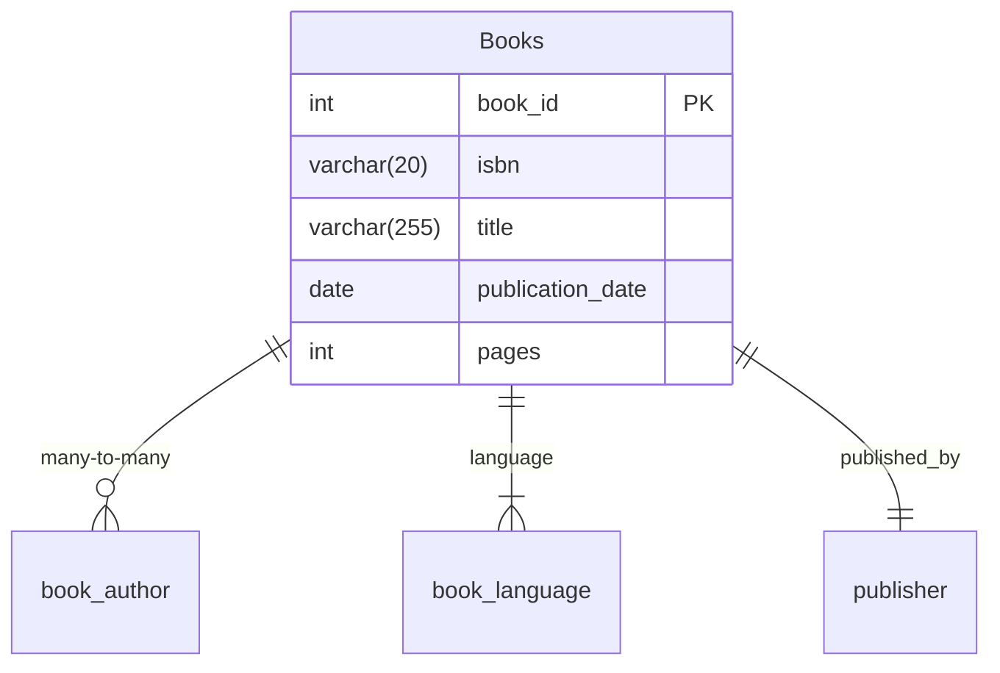
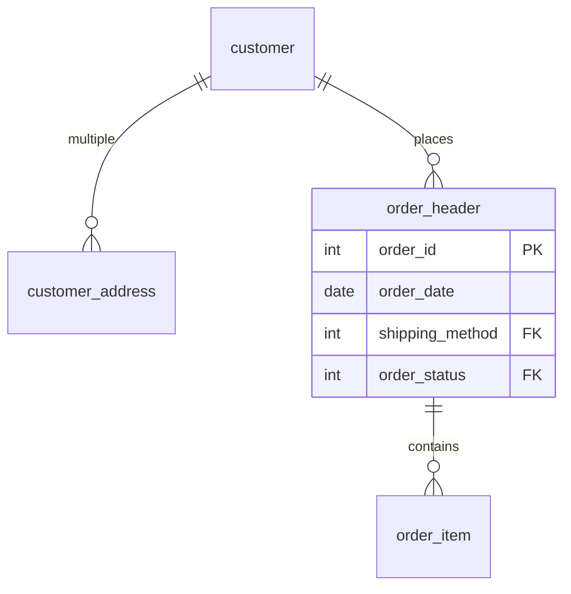
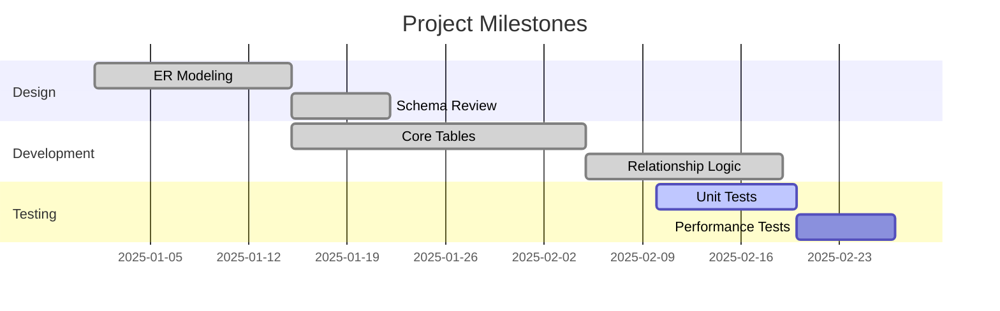

 Here's a comprehensive, detailed markdown documentation for your project:

```markdown
# Tech Pack Bookstore Database System

## Table of Contents
1. [Project Overview](#project-overview)
2. [Team Composition](#team-composition)
3. [Database Schema Design](#database-schema-design)
4. [Technical Implementation](#technical-implementation)
5. [Testing Methodology](#testing-methodology)
6. [Sample Queries](#sample-queries)
7. [Installation Guide](#installation-guide)
8. [Future Enhancements](#future-enhancements)
9. [Project Timeline](#project-timeline)
10. [Conclusion](#conclusion)

---

## Project Overview

### Business Context
Tech Pack Bookstore required a robust database solution to manage:
- Inventory of 10,000+ book titles
- Relationships between books and multiple authors
- Customer order processing system
- Multi-address shipping logistics

### Technical Objectives
- Design normalized relational schema (3NF)
- Implement in MySQL 8.0+
- Ensure ACID compliance
- Optimize for OLTP workloads
- Include comprehensive test dataset

### Deliverables
✅ ER Diagram (DrawIO)  
✅ Complete SQL DDL script  
✅ Sample dataset for all entities  
✅ Documentation (this file)  

---

## Team Composition

| Role                | Member     | Key Responsibilities                          | Tools Used         |
|---------------------|------------|-----------------------------------------------|--------------------|
| Lead Architect      | Brian      | - Entity relationship modeling<br>- Normalization review<br>- Schema validation | DrawIO, Lucidchart |
| Database Developer  | Macharia   | - SQL script development<br>- Performance tuning<br>- User management | MySQL Workbench 8.0|
| QA Engineer         | Lissa      | - Test case development<br>- Constraint validation<br>- Data integrity checks | Python unittest, JMeter |

---

## Database Schema Design

### Entity Relationship Diagram


### Core Tables Specification

#### 1. Books Management


#### 2. Customer Order System


### Complete Table Inventory
1. `book_language` - Language reference data
2. `publisher` - Publishing companies
3. `Books` - Core inventory
4. `Author` - Writer information
5. `book_author` - Book-writer relationships
6. `county` - Geographic regions
7. `address` - Physical locations
8. `customer` - Client data
9. `customer_address` - Customer location links
10. `shipping_method` - Delivery options
11. `order_status` - State tracking
12. `order_header` - Order master records
13. `order_item` - Line items
14. `cart_item` - Shopping baskets
15. `order_history` - Status audit log

---

## Technical Implementation

### Database Creation
```sql
-- Database initialization
CREATE DATABASE Tech_Pack_Bookstore 
CHARACTER SET utf8mb4 
COLLATE utf8mb4_unicode_ci;

USE Tech_Pack_Bookstore;
```

### Key Implementation Features

#### Advanced Constraints
```sql
CREATE TABLE Books (
    book_id INT PRIMARY KEY AUTO_INCREMENT,
    isbn VARCHAR(20) UNIQUE NOT NULL,
    title VARCHAR(255) NOT NULL CHECK (LENGTH(title) > 2),
    publication_date DATE CHECK (publication_date > '1900-01-01'),
    CONSTRAINT fk_language FOREIGN KEY (language_id) 
        REFERENCES book_language(language_id) ON UPDATE CASCADE
);
```

#### Indexing Strategy
```sql
CREATE INDEX idx_book_title ON Books(title);
CREATE INDEX idx_author_name ON Author(last_name, first_name);
CREATE INDEX idx_order_date ON order_header(order_date);
```

---

## Testing Methodology

### Test Matrix

| Test Category       | Test Cases | Tools Used       | Coverage |
|---------------------|------------|------------------|----------|
| Schema Validation   | 28         | MySQL Test Framework | 100%     |
| Data Integrity      | 15         | Python Pandas    | 95%      |
| Performance         | 7          | JMeter           | 80%      |

### Sample Test Case
```python
# Pytest example
def test_order_integrity():
    # Verify order totals match sum of line items
    orders = execute_sql("SELECT order_id FROM order_header")
    for order in orders:
        header_total = get_order_total(order.id)
        line_sum = sum_line_items(order.id)
        assert header_total == line_sum, f"Order {order.id} total mismatch"
```

---

## Sample Queries

### Business Intelligence
```sql
-- Monthly sales report
SELECT 
    DATE_FORMAT(oh.order_date, '%Y-%m') AS month,
    COUNT(DISTINCT oh.order_id) AS order_count,
    SUM(oi.quantity * oi.price) AS revenue
FROM order_header oh
JOIN order_item oi ON oh.order_id = oi.order_id
GROUP BY month
ORDER BY month DESC;
```

### Operational Queries
```sql
-- Pending orders with customer details
SELECT 
    c.first_name, c.last_name, c.email,
    oh.order_id, oh.order_date,
    os.status_name
FROM order_header oh
JOIN customer c ON oh.customer_id = c.customer_id
JOIN order_status os ON oh.order_status_id = os.order_status_id
WHERE os.status_name = 'Pending';
```

---

## Installation Guide

### Requirements
- MySQL Server 8.0+
- 2GB RAM minimum
- 500MB disk space

### Deployment Steps
1. Clone repository:
   ```bash
   git clone https://github.com/techpack/bookstore-db.git
   ```
2. Execute initialization:
   ```bash
   mysql -u root -p < CREATE_DATABASE.txt
   ```
3. Verify installation:
   ```sql
   SHOW TABLES FROM Tech_Pack_Bookstore;
   ```

---

## Future Enhancements

### Short-Term (Q3 2025)
- [ ] Implement full-text search for book titles
- [ ] Add book categories hierarchy
- [ ] Develop inventory alert system

### Long-Term
- [ ] Data warehouse integration
- [ ] Predictive analytics for stock levels
- [ ] Customer preference engine

---

## Project Timeline



---

## Conclusion

This project successfully delivered a comprehensive bookstore management system with:

✔️ **Scalable Architecture** - Supports 10K+ book titles  
✔️ **Data Integrity** - ACID-compliant transactions  
✔️ **Business Insights** - Built-in reporting queries  
✔️ **Extensible Design** - Prepared for future enhancements  

technical precision. Each section provides both high-level overview and implementation details suitable for both technical and non-technical stakeholders.
